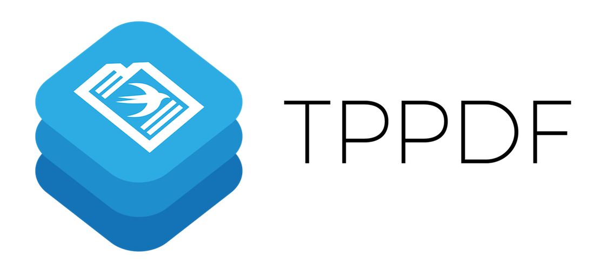
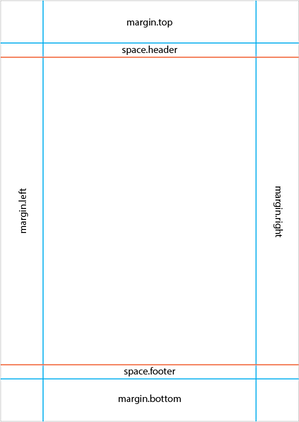
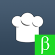

<p align="center">
	<a href="https://github.com/Carthage/Carthage">
		
	</a>
	
	
	<a href="http://cocoapods.org/pods/TPPDF">
		
	</a>
	<a href="http://cocoapods.org/pods/TPPDF">
		
	</a>
	<a href="http://cocoapods.org/pods/TPPDF">
		
	</a>
</p>

<p align="center">
	<a href="https://travis-ci.org/Techprimate/TPPDF">
		
	</a>
	<a href="https://codebeat.co/projects/github-com-techprimate-tppdf-master">
		
	</a>
	<a href="https://bettercodehub.com/results/Techprimate/TPPDF">
		
	</a>
	<a href="https://codecov.io/gh/Techprimate/TPPDF">
		
	</a>
</p>

<p align="center">
	<b>
	TPPDF is a fast PDF builder for iOS using simple commands to create advanced documents!
	</b>
</p>

<p align="center">
    <a href="#features">Features</a>
    <a href="#communication">Communication</a>
  • <a href="#usage">Example</a>
  • <a href="#usage">Installation</a>
  • <a href="#usage">Usage</a>
  • <a href="#credits">Credits</a>
  • <a href="#license">License</a>
</p>

## Features

- :white_check_mark: Page header and footer
- :white_check_mark: Dynamic content layout with page alignment
- :white_check_mark: Support for tables and cell alignment
- :white_check_mark: Attributed strings
- :white_check_mark: Custom spacing
- :white_check_mark: Image support
- :white_check_mark: Horizontal line separators
- :white_check_mark: Custom indentation
- :white_check_mark: Custom top offset (good for layered rendering)
- :white_check_mark: Pagination
- :white_check_mark: Image caption
- :white_check_mark: Compress images
- :white_check_mark: Custom image size fit
- :white_check_mark: Image in the header and footer
- :white_check_mark: Horizontal line separators in the header and footer
- :white_check_mark: Generate PDF files directly to handle large PDF files ([Details](http://stackoverflow.com/questions/14691264/how-can-i-lower-memory-climb-when-generating-large-pdfs))
- :white_check_mark: PDF metadata
- :white_check_mark: Custom table styling
- You need more features? Checkout #Contribute

## Communication

- If you **need help**, use [Stack Overflow](http://stackoverflow.com/questions/tagged/tppdf). (Tag 'TPPDF')
- If you'd like to **ask a general question**, use [Stack Overflow](http://stackoverflow.com/questions/tagged/tppdf).
- If you **found a bug**, open an issue.
- If you **have a feature request**, open an issue.
- If you **want to contribute**, submit a pull request.

## Example

To run the example project, run `pod try TPPDF`

## Usage

Building a PDF document is very easy:

First, you create a document with a paperformat...

```swift
let document = PDFDocument(format: .a4)
```

...then you add your information to a container...

```swift
document.addText(.contentCenter, text: "Create PDF documents easily.")
```

...then you render the document...
 
```swift 
PDFGenerator.generateURL(document: document, filename: "Example.pdf")
```

**...done!**

If you need more details, start here:

### Document creation

You can create a document using a predefined `PDFPageFormat` or by creating a custom `PDFPageLayout`:

```swift
let layout = PDFPageLayout()
let document = PDFDocument(layout: layout)
```
```swift
let document = PDFDocument(format: PDFPageFormat.a4)
```

### Page Layout

The following values can be set to format the page:

- `size` --- width and height of a page
- `margin` --- content inset on each side of a page
- `space.header` --- Space between header and content elements
- `space.footer` --- Space between footer and content elements

All values are in dots and are rendered using 72 DPI (dots per inch), as this is the default screen DPI.

You can also used the predefined formats. For details please refer to the source file [PDFPageFormat.swift](https://github.com/Techprimate/TPPDF/blob/master/Source/PDFPageFormat.swift)

If you need your page in landscape format, use the `landscapeSize` variable.



### Elements

TPPDF is element based. When adding any content to the document, you are actually adding an element. Then at the render process all elements are calculated and rendered. But first you need to understand the concept of the layout engine:

### Container

Every element is placed in a specific container. Three containers exist: Header, Content, Footer. Additionally every container has an alignment: Left, Center, Right.

When you add an new element, you need to provide the correct container - the default container is `ContentLeft`, therefore it is an optional parameter. During calculation it will place the element in the correct container and calculate the correct frame accordingly.

A good example would be the following:

```swift
let document = PDFDocument(format: .a4)
document.addText(.footerCenter, text: "Created using TPPDF for iOS.")
```

This command adds the text **Created using TPPDF for iOS** to the footer of all pages, because elements in the header and footer containers are placed on every page.

### Header & Footer

Basically all elements which are either to either a header (`headerLeft`, `headerCenter` or `headerRight`) or footer (`footerLeft`, `footerCenter` or `footerRight`) container, are considered as header and footer elements and will be repeated on each page.

If a page does not have any content, e.g. an empty page in between two pages, the header and footer elements won't be added to this page neither.

### List of element types

... now let's continue with the different kinds of elements.

#### Line Separator

```swift
let style = PDFLineStyle(type: .full, color: UIColor.darkGray, width: 0.5)
document.addLineSeparator(PDFContainer.contentLeft, style: style) 
```

Adds a horizontal line with a specific `style` in the given `container`. This line is affected by the `indentation`, therefore it is possible to change its width by setting a left and a right indentation before.

#### Simple Text

addText(_ container: PDFContainer = PDFContainer.contentLeft, text: String, lineSpacing: CGFloat = 1.0)     addText(_ container: PDFContainer = PDFContainer.contentLeft, textObject: PDFSimpleText)

#### Attributed Text

addAttributedText(_ container: PDFContainer = PDFContainer.contentLeft, text: NSAttributedString)
addAttributedText(_ container: PDFContainer = PDFContainer.contentLeft, textObject: PDFAttributedText) 


#### Image

addImage(_ container: PDFContainer = PDFContainer.contentLeft, image: PDFImage)

#### Images in one row

addImagesInRow(_ container: PDFContainer = PDFContainer.contentLeft, images: [PDFImage], spacing: CGFloat = 5.0) 

#### List

addList(_ container: PDFContainer = PDFContainer.contentLeft, list: PDFList) 

#### Table

addTable(_ container: PDFContainer = PDFContainer.contentLeft, table: PDFTable) 

### Helpers

The following methods of `PDFDocument` are not considered as elements, as they are only runtime changes to the calculations and rendering.

#### Space - `addSpace(_ container: PDFContainer, space: CGFloat)`

Adds a space with the height of `space` between the previous element and the next element.

```swift
document.setSpace(space: 32.0)
```

#### Simple Text Font - `setFont(_ container: PDFContainer, font: UIFont)`

Sets the font of a container. This font will be used in all following elements of type `PDFSimpleText` in the given container, until the font is changed. This font does not affect `PDFAttributedText` elements.

```swift
pdf.setFont(font: UIFont.systemFont(ofSize: 20.0))
```

#### Reset Simple Text Font - `resetFont(_ container: PDFContainer)`

This resets the font to the default font, which is `UIFont.systemFont(ofSize: UIFont.systemFontSize)`

```swift
pdf.resetFont(.contentLeft)
```

#### Simple Text Color - `setTextColor(_ container: PDFContainer, color: UIColor)`

Sets the font of a container. This font will be used in the next commands in the given container, if there is not a different font specified.

```swift
pdf.setFont(UIFont.systemFont(ofSize: 20.0))
```

#### Reset Simple Text Color - `resetTextColor(_ container: PDFContainer)`

This resets the font to the default font, which is `UIFont.systemFont(ofSize: UIFont.systemFontSize)`

```swift
pdf.resetFont(.contentLeft)
```

#### `setIndentation(_ container: PDFContainer, indent: CGFloat, left: Bool)` 

Set the indentation to a given `indent` in the container. By setting `left` to `false` you will change the indentation from the right edge.

```swift
pdf.setIndentation(indent: 50.0, left: true)
pdf.setIndentation(indent: 50.0, left: false)
```

Now the document has an indentation of `50` points from left and right edge.
If you need to reset the indentation, call the function with `0.0` as parameter

```swift
pdf.setIndentation(indent: 0.0)
```

#### `setAbsoluteOffset(_ container: PDFContainer, offset: CGFloat)`

Sets the offset in points from the top edge of a `container` to the given parameter `offset`.

This is useful if you need to layer multiple elements above each other.

#### Page Break

Simply call `document.createNewPage()` and it will add a page break. The next element will be positioned on the next page.

<!--
### Commands

The following commands are the ones available to you for creating your document. Most of these take a container as a parameter, defaulting to page content with left alignment. For the sake of readability, there is only a container in the example of `addText(...)`.

#### Lines

- `addLineSeparator(container, style)`

Draws a horizontal line using the given line style in the given container.

```swift
pdf.addLineSeparator(thickness: 0.1, style: PDFLineStyle(type: .dashed, color: UIColor.green, width: 1.0))
```

#### Text

- `addText(container, text, lineSpacing)`

Draws a text in the given container. It creates a attributed string and sets the linespacing.

```swift
pdf.addText(.ContentCenter, text: "Created using TPPDF for iOS.", lineSpacing: 5)
```

- `addAttributedText(container, attributedText)`

Draws a NSAttributedString in the given container.

```swift
let title = NSMutableAttributedString(string: "Awesome attributed title!", attributes: [
	NSFontAttributeName : UIFont.systemFontOfSize(28.0),
	NSForegroundColorAttributeName : UIColor(red: 219.0 / 255.0, green: 100.0 / 255.0, blue: 58.0 / 255.0, alpha: 1.0)
])
pdf.addAttributedText(text: title)
```

#### Image

- `addImage(container, image, size, caption, sizeFit)`

Draws an image in the given container. If the given size is not zero size, it will draw it using that size, proportionally scaling. The size of an image is scaled according to sizeFit. If the height of an image and its caption is beyond the page bounds, then a new page is created. The caption is an attributed string and can be styled (refer to `addAttributedText(...)` for an example).

```swift
pdf.addImage(image: UIImage(named: "Image.jpg")!)
```

- `addImagesInRow(container, images, captions, spacing)`

Draws images with captions in the row using the given spacing in the given container.

```swift
pdf.addImagesInRow(images: [UIImage(named: "image.jpg")!, UIImage(named: "PortraitImage.jpg")!], captions: [NSAttributedString(string: "Caption 1"), NSAttributedString(string: "Caption 2")])
```

#### Table

- `addTable(container, data, alignment, relativeColumnWidth, padding, margin, style)`

Draws a table in the given container.

The parameter data is a two-dimensional String array

```swift
let data: [[String]] = [
	["Rating",     "4.5 / 5",  "Prep\nTime:",   "14 Hours"    ],
	["Portions:",   "14",       "Cook\nTime:",   "16 Minutes" ]
]
```

The parameter alignment is a two-dimensional array with `PDFTableCellAlignment` values.

```swift
let alignments: [[PDFTableCellAlignment]] = [
	[.Left, .Center, .Left, .Center],
	[.Left, .Center, .Left, .Center]
]
```

The parameter `relativeColumnWidth` is an array of CGFloat smaller or equal than 1.0
These are relative widths in percentage to the full page content width (= page width - 2 * page margin). It defines the width of each column.

```swift
let widths: [CGFloat] = [
	0.3, 0.2, 0.3, 0.2
]
```

The data array and the alignments array must contain the equal amount of items. The widths array must have the same amount as the data array columns has.

Additional parameters are cell margin and cell padding. Margin is the spacing between each cell or between the cell and the table bounds. Padding is the spacing between the content of the cell to the cell bounds.

This works the same way as HTML/CSS margin and padding works. Checkout w3schools.com [margin](http://www.w3schools.com/css/css_margin.asp) and [padding](http://www.w3schools.com/css/css_padding.asp)

Table styling is done with a `PDFTableStyle` object. `PDFTableStyleDefaults` contain a couple of predefined table styles, which can be modified.
A table style consists out of five different styles, for the row header, column header, footer, content and for alternating rows. It is also possible to set custom cell styling using the method `setCellStyle(row, column, style)`.

Cell styling includes background fill color, text color, font and the line style for each border.

Line styling includes line color, line width and line type, which can be either non, full, dashed or dotted.

```swift
let tableStyle = PDFTableStyleDefaults.simple

tableStyle.setCellStyle(row: 2, column: 3, style: PDFTableCellStyle(fillColor: .yellow, textColor: .blue, font: UIFont.boldSystemFont(ofSize: 18)))
tableStyle.setCellStyle(row: 20, column: 1, style: PDFTableCellStyle(fillColor: .yellow, textColor: .blue, font: UIFont.boldSystemFont(ofSize: 18)))

pdf.addTable(data: tableData, alignment: tableAlignment, relativeColumnWidth: tableWidth, padding: 8, margin: 0, style: tableStyle)
```

--->

### Pagination

To customize pagination, create an instance of `PDFPagination` and set it to the `pagination` property of your document or simply edit the default one.

Pagination needs one container where it will add the pagination elements on each page. This defaults to `.none` which results in no pagination added.

It is possible to set pagination `range` with a `start` and `end` index. You can also hide specific pages, by adding the page nunber to the `hiddenPages` property. The range is set default to include all pages.
As an example this won't paginate page `1`, `2`, `5` nor any page above `7`:

```swift
let pagination = PDFPagination()
pagination.range = (start: 3, end: 7)
pagination.hiddenPages = [5]
```

To actually define the `style` of the pagination, you can either choose on of the predefined ones, or create a custom closure-based style. The pagination algorithm receives the `current` page number and the `total` pages amount and returns a String, which will then be transformed into a text element.

#### `.default`

This is the default pagination setting, converts page `1` of `3` to `1 - 3`

#### `.roman(template: String)`

Page `8` of `13` will be converted into roman numerals `VIII` and `XIII` and inserted in the format, e.g `%@ _|_ %@` becomes `VIII _|_ XIII`. The main idea of this preset is converting the numbers into roman numerals but configure the text using the format.

#### `.customNumberFormat(let template, numberFormatter: NumberFormatter)`

Both numbers are converted into a string using the provided `numberFormatter`. This allows you to use the full capabilities of the built-in formatter class. Afterwards both values are also inserted into the provided `template`.

Example:

```swift
let formatter = NumberFormatter.init()
formatter.alwaysShowsDecimalSeparator = true
formatter.numberStyle = .currency
formatter.currencyCode = "EUR"

let template = "%@ + %@"
```

Page `8` of `13` will return the following: `€8.00 + €13.00` which might be completly unsuitable as a pagination, but displays the possibilities. :) 

#### `customClosure(closure: (_ page: Int, _ total: Int) -> String)`

The `closure` will be called everytime the generator needs the pagination value. You have full control on how the resulting string will look like.

Example:

```swift
PDFPaginationStyle.customClosure({ (page, total) -> String in
	let separator: String = {
		switch page % 4 {
			case 1:
				return "#"
			case 2:
				return "&"
			case 3:
				return "*"
			default:
				return "-"
		}
	}()
	return "\(page) " + separator + " \(total)"
})
```

This example will return a different separator, depending on the modulo result.

#### MORE!

If you want a specific style to be included in the presets, please open an issue! The more presets can be provided the better for everyone!

### Document Info

To store metadata information in the document, change the values of the `info` property.
You are able to set a `title`, `author`, `subject` and `keywords`.

If you need to encrypt the document, set an `owner password` and a `user password`. Also you can restrict printing and copying by setting the `allows printing` and `allows copying` flags.

## Installation

### Requirements

| Language  | Branch | Pod version | Xcode version | iOS version |
| --------- | ------ | ----------- | ------------- | ----------- |
| Swift 4.0 | [master](https://github.com/techprimate/TPPDF/tree/master) | >= 1.0.x | Xcode 9 or greater| iOS 8.3+ |
| Swift 3.0 | [master](https://github.com/techprimate/TPPDF/tree/master) | >= 0.2.x | Xcode 8 or greater| iOS 8.0+ |
| Swift 2.3 | [swift-2.3](https://github.com/techprimate/TPPDF/tree/swift-2.3) | 0.1.5 | Xcode 8, Xcode 7.3.x | iOS 8.0+ |
| Swift 2.2 | [swift-2.2](https://github.com/techprimate/TPPDF/tree/swift-2.3) | 0.1.4 | Xcode 7.3.x | iOS 8.0+ |


### CocoaPods

[CocoaPods](http://cocoapods.org) is a dependency manager for Cocoa projects. You can install it with the following command:

```bash
$ gem install cocoapods
```

To integrate TPPDF into your Xcode project using CocoaPods, specify it in your `Podfile`:

```ruby
source 'https://github.com/CocoaPods/Specs.git'
platform :ios, '10.0'
use_frameworks!

target '<Your Target Name>' do
    pod 'TPPDF'
end
```

Then, run the following command:

```bash
$ pod install
```

### Carthage

[Carthage](https://github.com/Carthage/Carthage) is a decentralized dependency manager that builds your dependencies and provides you with binary frameworks.

You can install Carthage with [Homebrew](http://brew.sh/) using the following command:

```bash
$ brew update
$ brew install carthage
```

To integrate TPPDF into your Xcode project using Carthage, specify it in your `Cartfile`:

```ogdl
github "Techprimate/TPPDF" ~> 1.0
```

Run `carthage update` to build the framework and drag the built `Alamofire.framework` into your Xcode project

### Swift Package Manager

Swift Package Manager is not supported, as TPPDF requires the framework `UIKit` which is not available on macOS or Linux.

### Manually

If you prefer not to use either of the aforementioned dependency managers, you can integrate TPPDF into your project manually.

#### Embedded Framework

- Open up Terminal, `cd` into your top-level project directory, and run the following command "if" your project is not initialized as a git repository:

```bash
$ git init
```

- Add TPPDF as a git [submodule](http://git-scm.com/docs/git-submodule) by running the following command:

```bash
$ git submodule add https://github.com/Techprimate/TPPDF.git
```

- Open the new `TPPDF` folder, and drag the `TPPDF.xcodeproj` into the Project Navigator of your application's Xcode project.

    > It should appear nested underneath your application's blue project icon. Whether it is above or below all the other Xcode groups does not matter.

- Select the `TPPDF.xcodeproj` in the Project Navigator and verify the deployment target matches that of your application target.
- Next, select your application project in the Project Navigator (blue project icon) to navigate to the target configuration window and select the application target under the "Targets" heading in the sidebar.
- In the tab bar at the top of that window, open the "General" panel.
- Click on the `+` button under the "Embedded Binaries" section.
- You will see two different `TPPDF.xcodeproj` folders each with two different versions of the `TPPDF.framework` nested inside a `Products` folder.

    > It does not matter which `Products` folder you choose from, but it does matter whether you choose the top or bottom `TPPDF.framework`. 
    
- Select the top `TPPDF.framework` for iOS and the bottom one for OS X.

    > You can verify which one you selected by inspecting the build log for your project. The build target for `TPPDF` will be listed as either `TPPDF iOS` or `TPPDF OSX`.

- And that's it!

> The `TPPDF.framework` is automagically added as a target dependency, linked framework and embedded framework in a copy files build phase which is all you need to build on the simulator and a device.

## Apps using TPPDF

If you are using TPPDF in your app and want to be listed here, simply create a pull request or let me know on twitter or via github. I am always curious who is using my projects :)

[Hikingbook](https://itunes.apple.com/app/id1067838748) - by Zheng-Xiang Ke


[Bug Journal](https://itunes.apple.com/us/app/bug-journal/id1232077952) - by David Johnson


[Mama's Cookbook (future release)](https://itunes.apple.com/us/app/mamas-cookbook/id1019090528) - by Philip Niedertscheider



## Credits

TPPDF is created by Philip Niedertscheider, owned by [techprimate](https://www.github.com/techprimate)

<p align="center">
	<a href="https://www.techprimate.com">
		
	</a>
	<a href="http://twitter.com/techprimate">
	    
	</a>
	<a href="https://facebook.com/techprimate">
		
	</a>
</p>


### Contributors

- Philip Niedertscheider, [techprimate-phil](https://www.github.com/techprimate-phil)
- Zheng-Xiang Ke, [kf99916](https://www.github.com/kf99916)

### Thank You

Special thanks goes to **Nutchaphon Rewik** for his project [SimplePDF](https://github.com/nRewik/SimplePDF) for the inspiration.

## License

TPPDF is available under the MIT license. See the [LICENSE](LICENSE) file for more info.
